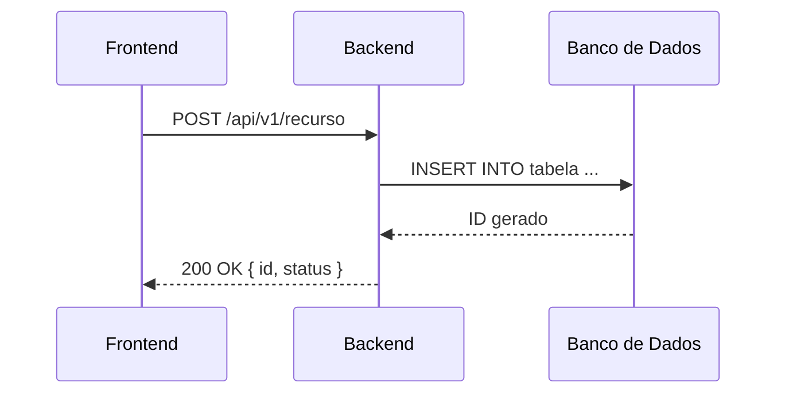

# Documentação de APIs

Todo documento de API deve ser criado no diretório `/api_documentation` com o prefixo `api-`.

**Nome do arquivo:** `api-nome_da_api.md`

---

## Conteúdo mínimo obrigatório

1. **Objetivo do endpoint:** o que ele faz e qual problema resolve.
2. **Autenticação/autorização:** tipo (Bearer, API Key, OAuth), escopos e permissões exigidas.
3. **Contrato de entrada (request):** método HTTP, path, headers, query params e body — com exemplos.
4. **Contrato de saída (response):** estrutura, tipos e exemplos para cada código HTTP relevante.
5. **Validações de campos:** regras de negócio e técnicas aplicadas a cada campo.
6. **Máscaras e formatos:** descrever formatos esperados (CPF, CNPJ, CEP, telefone, datas), exemplos e referência às validações/regex ou ao código que aplica a máscara.
7. **Tabela de erros e códigos HTTP:** código, mensagem e causa.
8. **Cenário de uso:** fluxo narrativo de uso do endpoint.
9. **Diagrama de sequência (Mermaid):** interações entre frontend, backend e banco.
10. **Artefatos relacionados e impactos:** requisitos, outros endpoints, diagramas e documentos impactados.
11. **Histórico de alterações** e **esclarecimentos** ao final (ver pasta `template/`).

---

## Template de documento de API

```markdown
# API: [Nome da API]

| Campo  | Valor                            |
| ------ | -------------------------------- |
| Versão | 1.0.0                            |
| Data   | DD/MM/AAAA                       |
| Autor  | Nome                             |
| Status | rascunho / em revisão / aprovado |

## Objetivo

[Descrever o que o endpoint faz e qual problema de negócio resolve.]

## Autenticação

- Tipo: Bearer Token / API Key / OAuth 2.0
- Escopo necessário: `scope.nome`

## Requisição

**Método:** `POST`
**Path:** `/api/v1/recurso`

### Headers

| Header          | Obrigatório | Descrição        |
| --------------- | ----------- | ---------------- |
| `Authorization` | Sim         | Bearer {token}   |
| `Content-Type`  | Sim         | application/json |

### Body (request)

```json
{
  "campo1": "valor_exemplo",
  "campo2": 123
}
```

### Dicionário de campos da requisição

| Campo  | Caminho  | Tipo    | Tamanho | Obrigatório | Máscara/Formato | Descrição          |
| ------ | -------- | ------- | ------- | ----------- | --------------- | ------------------ |
| campo1 | $.campo1 | string  | 255     | Sim         | —               | Descrição do campo |
| campo2 | $.campo2 | integer | —       | Não         | —               | Descrição do campo |

## Resposta

### 200 — Sucesso

```json
{
  "id": 1,
  "status": "criado"
}
```

### Tabela de erros

| Código HTTP | Código interno | Mensagem                   | Causa                             |
| ----------- | -------------- | -------------------------- | --------------------------------- |
| 400         | ERR_001        | Campo obrigatório ausente  | campo1 não informado              |
| 401         | ERR_002        | Token inválido ou expirado | Token ausente ou malformado       |
| 422         | ERR_003        | Formato inválido           | campo1 fora do padrão esperado    |
| 500         | ERR_500        | Erro interno               | Falha inesperada no processamento |

## Diagrama de sequência



## Cenário de uso

[Descrever em prosa o fluxo completo de uso: quem chama, quando, com que dados e o que espera receber.]

## Artefatos relacionados

- Requisitos que impactam esta API:
- Requisitos impactados por esta API:
- Documentos técnicos relacionados (diagramas, dicionário de dados, procedures):

[histórico e esclarecimentos — ver pasta template/]

```

---

## Boas práticas para documentação de APIs

- Inclua **exemplos reais** (ou mascarados) de request e response.
- Documente **todos os códigos de erro possíveis**, não apenas os do caminho feliz.
- Indique claramente **campos com máscara ou formato especial** e o regex ou biblioteca que os valida.
- Ao documentar endpoints que chamam procedures SQL, incluir referência cruzada com o artefato de banco de dados.
- Mantenha o diagrama de sequência **atualizado** a cada mudança de contrato.
