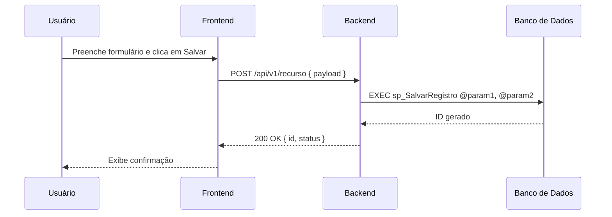
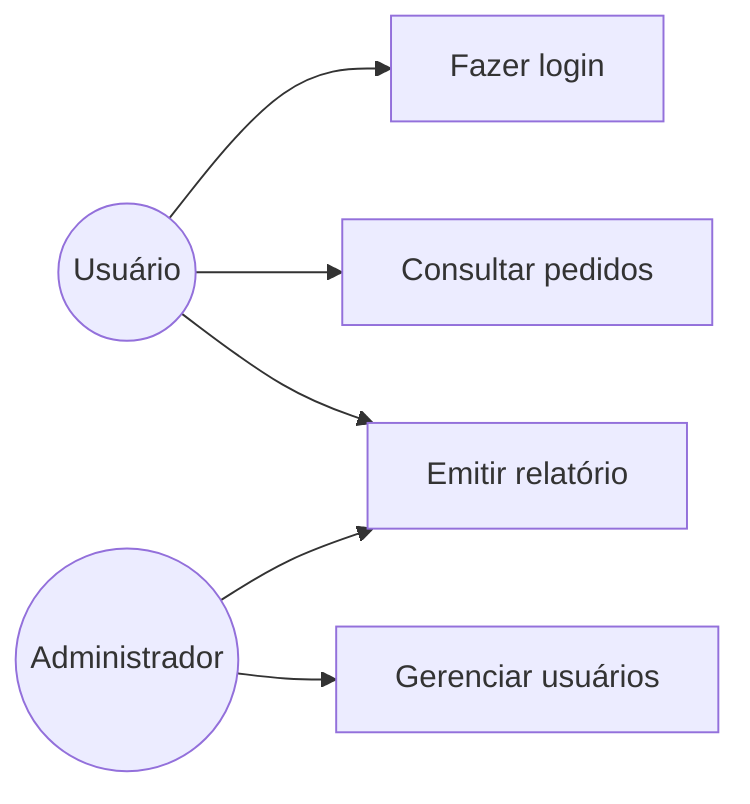
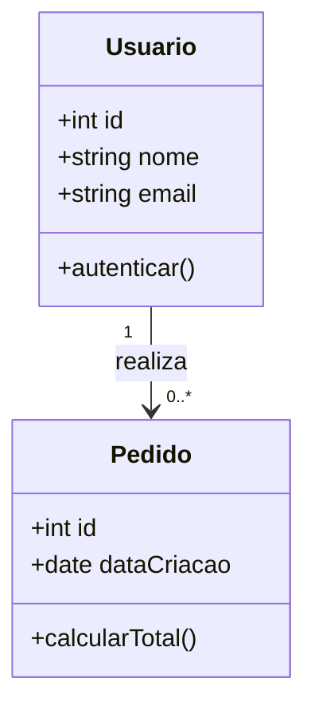
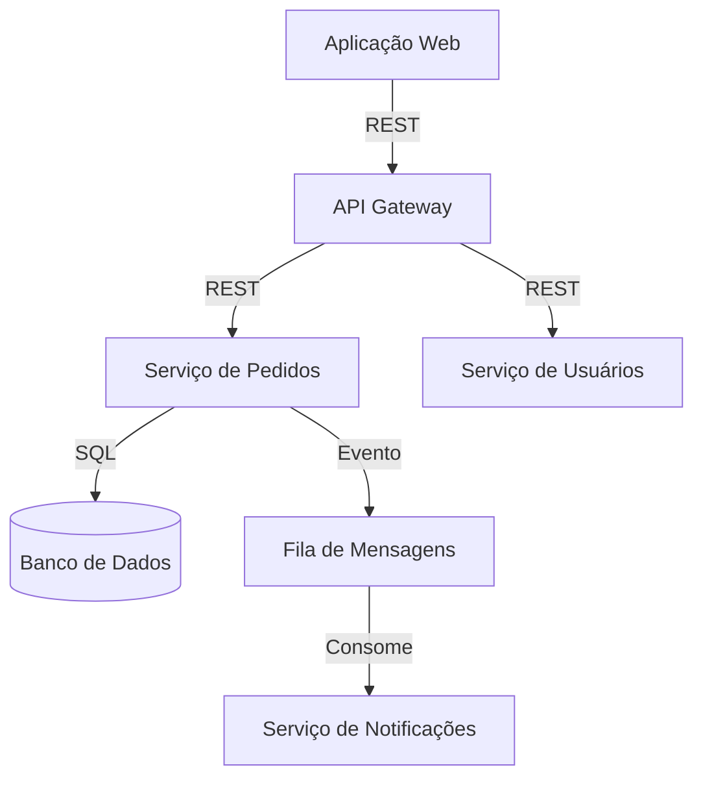
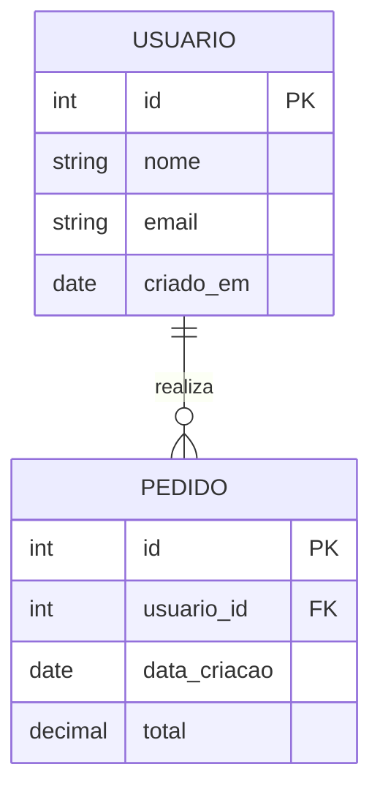
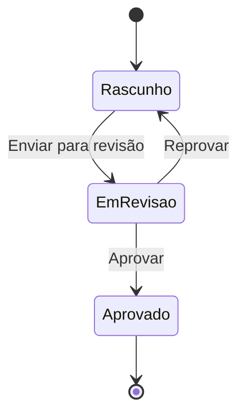

# Diagramas e visualização

Use diagramas sempre que o texto não for suficiente para eliminar dúvidas de interpretação.

Todos os diagramas são criados em **Mermaid.js** e armazenados no diretório `/diagrams` com o prefixo correspondente ao tipo.

---

## Tipos de diagrama e quando usar

### Diagrama de sequência
**Prefixo:** nenhum (embutido no documento de requisito ou API)
**Uso:** exibir interações entre componentes ao longo do tempo — ideal para fluxos de API, autenticação, processos assíncronos.

---

### Diagrama de casos de uso
**Uso:** mostrar fronteiras do sistema, atores e suas interações de alto nível.

---

### Diagrama de classes (`dcl-`)
**Arquivo:** `/diagrams/dcl-nome_do_diagrama.md`
**Uso:** modelar estrutura de código, atributos, métodos e relacionamentos entre classes.

---

### Diagrama de integração de sistemas (`min-`)
**Arquivo:** `/diagrams/min-nome_do_diagrama.md`
**Uso:** mapear fluxo de dados entre sistemas, serviços e integrações externas.

---

### Diagrama de entidades e relacionamentos (`der-`)
**Arquivo:** `/diagrams/der-nome_do_diagrama.md`
**Uso:** documentar modelo de dados, entidades, atributos e relacionamentos.

---

### Diagrama de fluxo / estado
**Uso:** representar lógica de navegação, estados de uma entidade ou decisões de fluxo.

---

## Diretrizes de uso

- Prefira Mermaid.js para todos os diagramas — mantém a documentação versionável junto ao código.
- Use ASCII Mermaid como fallback apenas quando a ferramenta não suportar renderização.
- **Todo diagrama deve ter título e breve descrição** explicando o que representa.
- Valide a sintaxe Mermaid antes de finalizar o documento.
- Diagramas de sequência são **obrigatórios** em documentos de API e em requisitos que descrevam fluxos multi-camada.
- DER e DCL são **obrigatórios** quando a funcionalidade envolve modelo de dados relevante.
