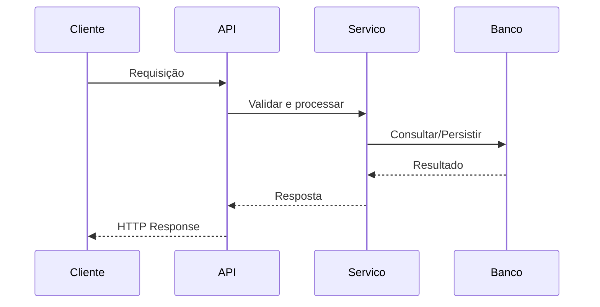

# API Template

## Metadados

- **Código do documento:** `api-template`
- **Título:** Template de Documentação de API
- **Data de criação:** DD/MM/AAAA
- **Última atualização:** DD/MM/AAAA
- **Autor:** Nome do autor
- **Versão:** 1.0.0
- **Status:** Rascunho | Em revisão | Aprovado

## Objetivo

Descrever de forma inequívoca o comportamento técnico de um endpoint, serviço ou integração de API.

## Escopo

- O que está coberto por este documento
- O que está fora de escopo

## Artefatos relacionados

### Documentos/requisitos que impactam este artefato

- `req-...`
- `vis-...`

### Documentos/requisitos impactados por este artefato

- `did-...`
- `min-...`

### Componentes técnicos relacionados

- Controllers/endpoints:
- Services/use cases:
- DTOs/schemas:
- Tabelas/views/procedures:
- Filas/integradores externos:

## Contexto funcional

- Problema resolvido
- Usuário/consumidor
- Regra de negócio principal

## Identificação da API

- **Método HTTP:** GET | POST | PUT | PATCH | DELETE
- **Rota:** `/api/...`
- **Autenticação:** Nenhuma | Bearer | API Key | OAuth2
- **Autorização:** Perfis, claims, policies
- **Rate limit:** informar se aplicável

## Parâmetros de entrada

| Campo | Local | Tipo | Obrigatório | Regra/Validação | Exemplo |
| ----- | ----- | ---- | ----------- | --------------- | ------- |
| campo_exemplo | body/query/path/header | string | Sim/Não | Descrever regra | valor |

## Exemplo de request

```json
{
  "campo": "valor"
}
```

## Processamento e regras de negócio

1. Validar entrada
2. Aplicar regras de autorização
3. Executar processamento principal
4. Persistir/consultar dados
5. Montar resposta

## Exemplo de response de sucesso

```json
{
  "status": "success",
  "data": {}
}
```

## Códigos de retorno e erros

| HTTP | Código interno | Quando ocorre | Ação esperada |
| ---- | -------------- | ------------- | ------------- |
| 200  |                |               |               |
| 201  |                |               |               |
| 400  |                |               |               |
| 401  |                |               |               |
| 403  |                |               |               |
| 404  |                |               |               |
| 500  |                |               |               |

## Exemplo de erro

```json
{
  "status": "error",
  "message": "Descrição do erro"
}
```

## Diagrama de sequência



## Cenários de uso

- Cenário principal:
- Cenário alternativo:
- Cenário de exceção:

## Impactos técnicos

- Backend:
- Frontend:
- Banco de dados:
- Observabilidade/logs:
- Segurança:

## Validações realizadas para esta documentação

- [ ] README do projeto analisado
- [ ] Código-fonte relacionado analisado
- [ ] Contratos e DTOs validados
- [ ] Banco/procedure/view verificados
- [ ] Documentações correlatas revisadas

## Histórico de alterações

| Data | Autor | Versão | Alteração |
| ---- | ----- | ------ | --------- |
| DD/MM/AAAA | Nome | 1.0.0 | Criação do documento |

## Esclarecimentos

- Premissas consideradas:
- Dúvidas pendentes:
- Decisões tomadas:
