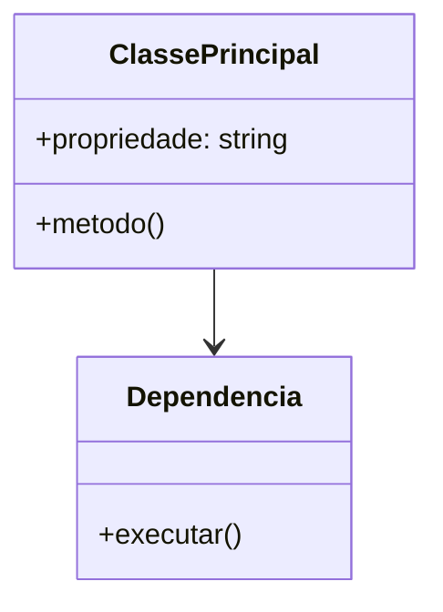

# Diagrama de Classes Template

## Metadados

- **Código do documento:** `dcl-template`
- **Título:** Template de Diagrama de Classes
- **Data de criação:** DD/MM/AAAA
- **Última atualização:** DD/MM/AAAA
- **Autor:** Nome do autor
- **Versão:** 1.0.0
- **Status:** Rascunho | Em revisão | Aprovado

## Objetivo

Representar a estrutura lógica do domínio e das classes envolvidas na funcionalidade.

## Escopo

- Módulos cobertos:
- Limites do diagrama:

## Artefatos relacionados

### Documentos/requisitos que impactam este artefato

- `req-...`
- `api-...`

### Documentos/requisitos impactados por este artefato

- `did-...`
- `der-...`

### Componentes técnicos relacionados

- Classes principais:
- Interfaces/abstrações:
- DTOs/VOs:
- Repositórios:

## Descrição textual da modelagem

- Responsabilidades das classes:
- Relacionamentos relevantes:
- Regras de negócio refletidas no modelo:

## Diagrama Mermaid

## Observações de implementação

- Herança:
- Associação:
- Agregação/composição:
- Dependências externas:

## Validações realizadas para esta documentação

- [ ] Classes e interfaces reais analisadas
- [ ] Relacionamento com requisitos validado
- [ ] Impactos em banco/API considerados

## Histórico de alterações

| Data | Autor | Versão | Alteração |
| ---- | ----- | ------ | --------- |
| DD/MM/AAAA | Nome | 1.0.0 | Criação do documento |

## Esclarecimentos

- Premissas consideradas:
- Dúvidas pendentes:
- Decisões tomadas:
