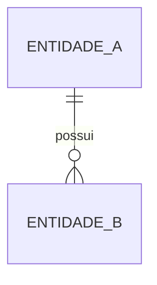

# DER Template

## Metadados

- **Código do documento:** `der-template`
- **Título:** Template de Diagrama de Entidade e Relacionamento
- **Data de criação:** DD/MM/AAAA
- **Última atualização:** DD/MM/AAAA
- **Autor:** Nome do autor
- **Versão:** 1.0.0
- **Status:** Rascunho | Em revisão | Aprovado

## Objetivo

Documentar a estrutura lógica das entidades persistidas e seus relacionamentos.

## Escopo

- Domínio/modelo coberto:
- Limites do DER:

## Artefatos relacionados

### Documentos/requisitos que impactam este artefato

- `req-...`
- `did-...`

### Documentos/requisitos impactados por este artefato

- `api-...`
- `dcl-...`

### Componentes técnicos relacionados

- Tabelas:
- Views:
- Procedures/functions:
- Regras de integridade:

## Descrição das entidades

| Entidade | Descrição | Chave primária | Observações |
| -------- | --------- | -------------- | ----------- |
|          |           |                |             |

## Relacionamentos

| Origem | Destino | Cardinalidade | Regra |
| ------ | ------- | ------------- | ----- |
| ENTIDADE_A | ENTIDADE_B | 1:1 / 1:N / N:N | Descrever regra do relacionamento |

## Diagrama Mermaid

## Regras de integridade e impacto

- FKs relevantes:
- Restrições:
- Índices críticos:
- Impactos em consultas e procedures:

## Validações realizadas para esta documentação

- [ ] Schema/tabelas reais analisados
- [ ] Relacionamentos validados
- [ ] Impactos em API/requisitos revisados

## Histórico de alterações

| Data | Autor | Versão | Alteração |
| ---- | ----- | ------ | --------- |
| DD/MM/AAAA | Nome | 1.0.0 | Criação do documento |

## Esclarecimentos

- Premissas consideradas:
- Dúvidas pendentes:
- Decisões tomadas:
