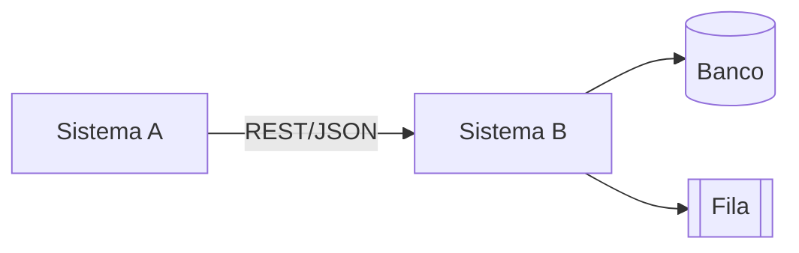

# Integração de Sistemas Template

## Metadados

- **Código do documento:** `min-template`
- **Título:** Template de Diagrama de Integração de Sistemas
- **Data de criação:** DD/MM/AAAA
- **Última atualização:** DD/MM/AAAA
- **Autor:** Nome do autor
- **Versão:** 1.0.0
- **Status:** Rascunho | Em revisão | Aprovado

## Objetivo

Documentar a comunicação entre sistemas, serviços, filas, APIs e dependências externas.

## Escopo

- Integrações incluídas:
- Integrações fora do escopo:

## Artefatos relacionados

### Documentos/requisitos que impactam este artefato

- `req-...`
- `api-...`

### Documentos/requisitos impactados por este artefato

- `vis-...`
- `did-...`

### Componentes técnicos relacionados

- Sistemas externos:
- APIs:
- Filas/tópicos:
- Jobs/processos agendados:

## Descrição da integração

- Origem dos dados:
- Destino dos dados:
- Protocolo/formato:
- Autenticação/autorização:
- Tratamento de falhas:

## Diagrama Mermaid

## Regras e dependências

- Ordem de chamadas:
- Regras de retry:
- Timeout/circuit breaker:
- Observabilidade e logs:

## Validações realizadas para esta documentação

- [ ] Fluxo real da integração analisado
- [ ] Dependências externas identificadas
- [ ] Tratamento de erro documentado
- [ ] Impactos em requisitos/documentos revisados

## Histórico de alterações

| Data | Autor | Versão | Alteração |
| ---- | ----- | ------ | --------- |
| DD/MM/AAAA | Nome | 1.0.0 | Criação do documento |

## Esclarecimentos

- Premissas consideradas:
- Dúvidas pendentes:
- Decisões tomadas:
