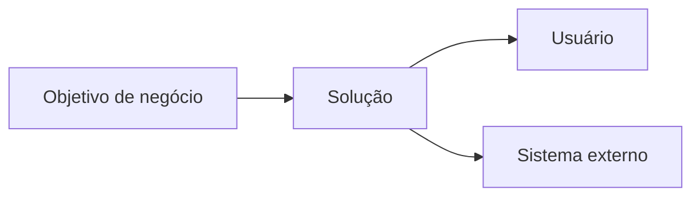

# Visão Template

## Metadados

- **Código do documento:** `vis-template`
- **Título:** Template de Documento de Visão
- **Data de criação:** DD/MM/AAAA
- **Última atualização:** DD/MM/AAAA
- **Autor:** Nome do autor
- **Versão:** 1.0.0
- **Status:** Rascunho | Em revisão | Aprovado

## Objetivo

Descrever o contexto de negócio, os objetivos, os stakeholders e os limites da solução.

## Escopo

### Dentro do escopo

-

### Fora do escopo

-

## Problema de negócio

- Dor atual:
- Impacto atual:
- Oportunidade esperada:

## Objetivos e métricas de sucesso

| Objetivo | Métrica | Meta | Prazo |
| -------- | ------- | ---- | ----- |
|          |         |      |       |

## Stakeholders e atores

| Nome/Papel | Responsabilidade | Interesse |
| ---------- | ---------------- | --------- |
|            |                  |           |

## Artefatos relacionados

### Documentos/requisitos que impactam este artefato

- `req-...`
- `apr_req-...`

### Documentos/requisitos impactados por este artefato

- `api-...`
- `min-...`
- `dcl-...`

### Componentes técnicos relacionados

- Módulos/sistemas:
- Integrações:
- Bases de dados:
- Telas/fluxos UX:

## Contexto da solução

- Visão geral da solução:
- Benefícios esperados:
- Restrições relevantes:
- Dependências externas:

## Diagrama de contexto

## Riscos e premissas

- Premissas:
- Riscos:
- Mitigações:

## Validações realizadas para esta documentação

- [ ] README do projeto analisado
- [ ] Requisitos relacionados revisados
- [ ] Stakeholders identificados
- [ ] Impactos em artefatos derivados mapeados

## Histórico de alterações

| Data | Autor | Versão | Alteração |
| ---- | ----- | ------ | --------- |
| DD/MM/AAAA | Nome | 1.0.0 | Criação do documento |

## Esclarecimentos

- Premissas consideradas:
- Dúvidas pendentes:
- Decisões tomadas:
